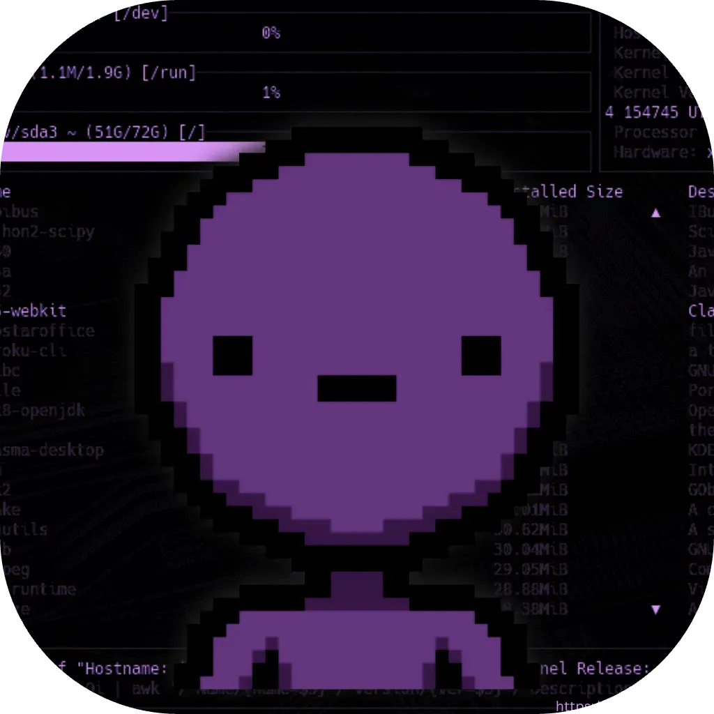

<h1>@ukrio</h1>
<a href="https://ukrioo.github.io" target="_blank"> </a>
  
> You can find all about me and my socials on my site,
> Make sure to check it out if you want to know more!
 

<h3>🏆 Trophies</h3>
<picture>
  <source media="(prefers-color-scheme: dark)" srcset="https://github-profile-trophy.vercel.app/?username=ukrioo&no-frame=true&no-bg=true&column=4&theme=darkhub">
  <source media="(prefers-color-scheme: light)" srcset="https://github-profile-trophy.vercel.app/?username=ukrioo&no-frame=true&no-bg=true&column=4">
  
</picture>

<h3>🌐 Website</h3>

> Did you know?  
> You can visit by website by going to [ukrio.is-a.dev](https://ukrio.is-a.dev), [ukrioo.github.io](https://ukrioo.github.io) or [ukrio.pages.dev](https://ukrio.pages.dev)!

<h6>Lighthouse PageSpeed Stats for my site:</h6>

<a href="https://ukrioo.github.io">
<picture>
  <source media="(prefers-color-scheme: dark)" srcset="media/stats_dark.svg">
  <source media="(prefers-color-scheme: light)" srcset="media/stats_light.svg">
  
</picture>
</a>

<h5>Made it this far? Here's a joke</h5>

---

<h3>⚡ Recent Activity</h3>

> I hope you know, I'm not active here! 
> ⚠️ Private Activity is NOT shown!

<!--START_SECTION:activity-->
1. 🎉 Merged PR [#3](https://github.com/ukrioo/ukrioo.github.io/pull/3) in [ukrioo/ukrioo.github.io](https://github.com/ukrioo/ukrioo.github.io)
2. 🎉 Merged PR [#2](https://github.com/ukrioo/ukrioo.github.io/pull/2) in [ukrioo/ukrioo.github.io](https://github.com/ukrioo/ukrioo.github.io)
3. 🗣 Commented on [#2](https://github.com/ukrioo/ukrioo.github.io/pull/2#issuecomment-2296070936) in [ukrioo/ukrioo.github.io](https://github.com/ukrioo/ukrioo.github.io)
4. 💪 Opened PR [#15617](https://github.com/is-a-dev/register/pull/15617) in [is-a-dev/register](https://github.com/is-a-dev/register)
5. 💪 Opened PR [#232](https://github.com/nyas1/Material-You-app-list/pull/232) in [nyas1/Material-You-app-list](https://github.com/nyas1/Material-You-app-list)
<!--END_SECTION:activity-->
 

---

<picture>
  <source media="(prefers-color-scheme: dark)" srcset="https://raw.githubusercontent.com/ukrioo/ukrioo/output/github-contribution-grid-snake-dark.svg">
  <source media="(prefers-color-scheme: light)" srcset="https://raw.githubusercontent.com/ukrioo/ukrioo/output/github-contribution-grid-snake.svg">
  
</picture>

